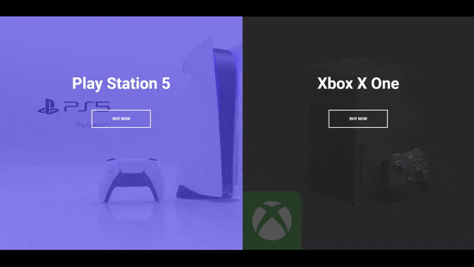

# Split Landing Page

## 🚀 Overview

A split landing page created with HTML5, CSS3, and vanilla JavaScript.

### 🎯 Project Goals:
- Design a split screen with a background image and a button.
- Implement an interaction where clicking on one side expands it to 75% and the other side to 25%.
- Style the page with CSS for smooth transitions.
- Add hover effects using JavaScript for dynamic interactions.

## 🛠️ Built With

- [HTML5](https://www.w3schools.com/html/)
- [CSS3](https://www.w3schools.com/css/)
- [JavaScript](https://www.w3schools.com/js/)
